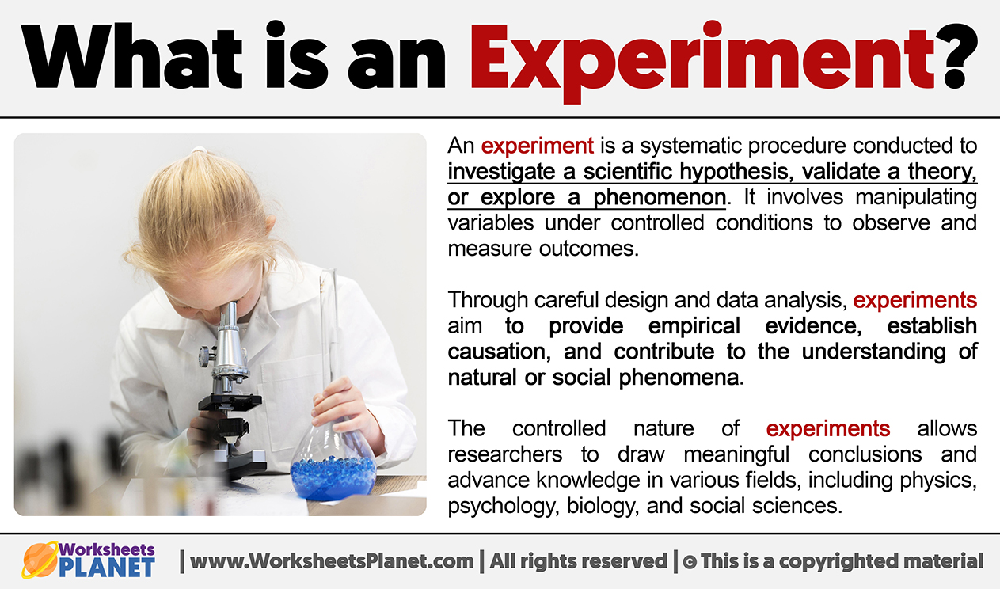
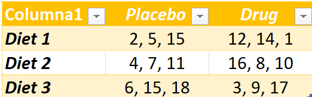
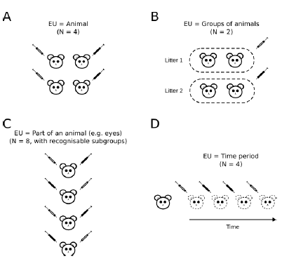
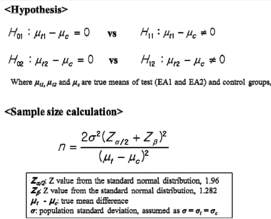
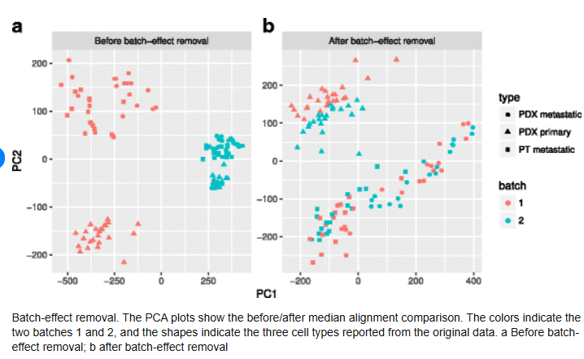

<style type="text/css">
.remark-slide-content {
    font-size: 22px;
    padding: 1em 4em 1em 4em;
}
.left-code {
  color: #777;
  width: 38%;
  height: 92%;
  float: left;
}
.right-plot {
  width: 60%;
  float: right;
  padding-left: 1%;
}
</style>


```{r setup, include=FALSE}
options(htmltools.dir.version = FALSE, echo=FALSE,
        message=FALSE,warning=FALSE,
        fig.dim=c(4.8, 4.5), fig.retina=2, out.width="100%")

knitr::opts_chunk$set(echo = FALSE)

knitr::knit_hooks$set(mysize = function(before, options, envir) {
  if (before) 
    return(options$size)
})
```

# Outline

.columnwide[

### 1) [Experiments: What, why, how](#Introduction)

### 2) [Principles of experimental design](#Principles)

### 3) [Basic types of experimental designs](#TiposDisenyos)

### 4) [Some resources](#Resources)

]

---

class: inverse, middle, center

name: Introduction

# Experiments: What, Why, How

---




---

# Why experiment?

- The purposes of experimental studies are diverse. For example, we could propose experiments<sup>1</sup> to:

  1. Compare responses to different treatments.
  2. Determine the cause (s) of the response variation.
  3. Find the conditions in which the optimal response is reached,
  4. Develop a model to predict responses.
  
- A characteristic of experimental versus observational studies is that, _under the right conditions, the former are the only ones that allow establishing causal relationships_.

.footnote[[1] Exercise: *Provide examples/references of experiments of each type*]

---

# Why Experimental Design

- In most research contexts, experimental design is not a formality

- It determines what questions can be answered, and which ones cannot, regardless of the amount of data collected

- Indeed, design choices often have a larger impact on results than the specific statistical method used

- Once the data have been collected, many limitations introduced by the design cannot be fixed<sup>1</sup>

.footnote[[1] Exercise: *When a study “does not show anything”, what do you think is more often the problem: the data, the analysis… or the way the study was designed?*]


---

# An example and basic ideas

- A study is perfoprmed to investigate the effect of a drug/therapy to prevent the development of diabetes in genetically modified mice.
- Effect will be tested and compared with that of a placebo.
- Effectiveness of the treatment may be affected by the diet of the animal, so distinct diets ("D1", "D2", "D3") are considered
- Mice randomly selected will receive a distinct combination of drug/placebo and D1/D2/D3 diet.
- To determine the effect of each drug/diet combination, weight, and decrease in insulin resistance will be determined.
.pull-left[
 
]
.pull-right[
<br>
 
]

---

# What is an experiment (again)

- An __experiment__ is 

  - any investigation 
  
  - in which a particular set of conditions 
  
  - is applied to selected (groups of) individuals 
  
  - and the results are observed and evaluated. 
  
- _For example, effect of therapy in pre-diabetic mice_

---

#  Factors, Levels and Blocks

- Each group of experimental conditions is a __treatment__ or __factor__, that is, something you actively vary or compare.
  - "Drug" or "Diet" are factors.

- Each particular condition within a factor is a __level__ of that factor.
  - "Drug" is a factor with two levels: *Drug/Placebo*.
  - "Diet" is a factor with three levels.

- A magnitude that simply differs across samples but whose levels cannot be arbitrarily assigned to an individual is a **block**.
  - "Age" or "Sex" are blocks


---

# Experimental Units

.pull-left[
- __Experimental Unit (UE) __ The physical entity or subject exposed to the treatment independently of other units.
  - A mouse, a patient, a piece 
  
- __Unit of observation (UO) __ The unit in which observations (that is, measurements) are carried out,
  - Several measurements on the same liver  of a mouse
  - Multiple measurements of a patient's blood pressure.
]

.pull-right[

 

From Lazic et al (2017) *What exactly is 'N' in cell culture and animal
experiments?*

]

---

# Sources of Variation
  
Distinguishing where variability arises is essential to design experiments and interpret results correctly.

### Experimental variation (between experimental units)

- Variation observed between different experimental units exposed to the same nominal experimental conditions.
- Reflects biological heterogeneity, micro-environmental fluctuations, uncontrolled factors, and natural diversity.
- Often referred to as *experimental error*.

### Observation (measurement) variation

- Observed when the same experimental unit is measured repeatedly.
- Reflects instrument precision, operator variability, technical noise, and measurement resolution.
- Can often be estimated using technical replicates.

---


# Types of variability

.pull-left[
_Random variability_
- Differences expected to be observed when different subjects from the same sample are measured.
- It is usually always present to a greater or lesser degree.
- It is usually reduced by increasing the sample size
 

]

.pull-right[
_Systematic variability_
- Differences between subjects or observations attributable to the measurement process or to a non-random selection of all the individuals in the sample.
- Usually can be corrected

 

]

---

# What characterizes an experiment?

<br>
1. The treatments to be used

2. The experimental units to be used

3. The way treatment levels are assigned to the experimental units.

  - This is precisely _**the experimental design**_

4. Responses that are measured

---

# A good experimental design ...


- __Avoids biases__ or systematic errors


- __Allows a precise estimation of the response__, which implies that the random error is as low as possible.


- __Allows an adequate estimation of the error__.


- __Has wide validity__: the experimental units are a sample of the population in question, so it is possible to extrapolate the conclusions of the sample to the population.

---

# Why do we need a good design

- Well designed experiments will be **scientifically sound**:

  - Smaller bias, 
  - Smaller variability, 
  - Higher generizability.
  
- They allow **saving money**
  
  - Budget can be done based on goals
  - Cost can be optimized
  
- Allows **avoiding unnecessary animal use**
  - [The three Rs](https://norecopa.no/alternatives/the-three-rs/)

---


# How to get a good design

- Apply basic ideas which, together, use to guarantee a good result.

  1. Rely on a _checklist_ of the experimental design.

  2. Apply _the scientific method in the appropriate study_.

  3. Be based on the basic principles of Experimental Design

      - Randomization, 
      - Replication, 
      - Local control.

- And also
  - Plan design and analysis __at the same time__,
  - Involve your favorite statistician from the beginning (or before) of the experiment.


---

# Design checklist

1. Define the objectives of the experiment.
2. Identify all possible sources of variation.
3. Select an appropriate experimental design.
4. Specify the experimental process
5. Conduct a pilot study
6. Specify the hypothesized model
7. Describe the tests to be performed.
8. Estimate the required sample size using the results.
of the pilot study
9. Review your decisions in 1 - 8 and make the 
necessary adjustments.

---

class: inverse, middle, center

name: Principles

# Principles of experimental design

---

# Eperimental design principles

- Good experimental designs share common traits.
  - Based on the logic of experimentation and the scientific method, 
  - Rely on *common principles *, whose application guarantees good designs, or, at least, better designs than those studies in which they are not taken into account explicitly. 

- Some of these principles are:

  - *Randomization* 

  - *Replication*

  - *Local control or blocking*

---

# 1. Randomization

- It is not possible to avoid random variations but, <br> by randomly assigning treatments to units the effect of such variation can be compensated.
<br><br>
*This is precisely what __randomization__ is about*.

- This can be done in many different ways depending on the experiment:

  - Randomly assigning individuals to treatments and/or
  - Running the experiments in random order.
  - ...
  
---

# Haphazard is not randomization

- **Randomizing does not mean doing everything at random**. 

- E.G. Imagine we have 4 treatments to be assigned to  16 units

  - **A good strategy** : 
      - Use sixteen identical slips of paper, 4 marked with A, 4 with B, and so on to D. 
      - Put the slips of paper into a basket and mix them thoroughly. 
      - For each unit, we draw a slip of paper from the basket and use the treatment marked on the slip
  - **A bad way to do it** 
      - Treatment A is assigned to the first four units we have encounter,
      - treatment B to next four units, and so on.
      - *This approach does not protect against possible unknown groupings in experimental units*.

---

# Randomization  avoids confounding
- Consider a new drug treatment for coronary artery disease. 
  - 2 treatments to compare: (1) drug treatment vs (2) bypass surgery. 
  - 100 patients will be assigned to one of the two treatments. 
  - We then measure five-year survival as a response.

- What sort of trouble can happen if we fail to randomize? 
  - Bypass surgery is a major operation, and patients with severe disease may not be strong enough to survive the operation:
	- We decide to assign stronger patients to surgery and the weaker patients to the drug therapy. 

- Patient strength  **is confounded**  with treatment differences. 
  - The drug therapy would likely have a lower survival rate because it is getting the weakest patients, even if the drug therapy is every bit as good as the surgery.

---
# Exercise

- Consider the experiment where we compare 
  - a treatement and a placebo
  - in combination with three diets
  - using a total of 18 mice
  
1. Propose and apply a method to randomize mice among treatments and diets.

2. Consider a sequential or a simultaneous approach. Would the results differ?

3. Choose an experimental study and try to think on how randomization should be performed.

---

# 2. Replication

- There is general agreement on the need *to apply each treatment independently to several ("more than ...") experimental units*.

- This ... 
  - Helps to establish the reproducibility of the results.
  - Protects against eventual abnormal or unusual results.
  - Provides a way to estimate the *biological* variability (associated to  *experimental error*) in the absence of systematic differences between the experimental units.
  - Provides the ability to increase the *precision of estimates* of means of treatment.
  
---
# Replication $\neq$ (necessarily) results!

- Replication is important but, _it does not necessarily guarantee valid estimates of experimental error_ or, what is more:

- Having the appropriate sample size **does not guarantee the presence of an effect**.

- The -often heard sentence- _"we didn't detect any effect but if we can collect enough samples the effect will show up"_ can be considered a _Statistical Myth_.
  
---

# Replicates, power and precision

- Number of repetitions $r$ relates to the _precision_ of the experiment
- Precision is inversely related with the Variability of the experiment.
$$
\mbox{Precision} \sim 1/var (\overline{X}) = r/\sigma ^ 2 \quad (*)
$$
- While this is stated for estimating the sample mean, the rule can be easily extended to other characterristics.

- From (*) it follows that:
    - the greater the number of replicatess, $r$,
    - and the lower the variability, $\sigma^2$,
    - the greater the precision a design provides.

- From this relation, it is straightforward to derive formulae for the sample size needed for estimation.

---

# How many replicates are needed?

- If the goal of an experiment is, not only estimating one characteristic, but also comparing groups, that is _detecting the effect of a treatment_,  this can also be accounted for.

- Given the relation between:
  - (1) The variability
  - (2) The desired effect size,
  - (3) The level of significance ("alpha", type I error) of the test,
  - (4) The power (1-"beta", type II error) wished to attain

- One can compute the sample size needed given the previous four values or, one can fix any three and compute the other one (for instance the power given a sample size, etc.)

---
# Sample size calculations

- Sample size to compare 2 (normal) samples with common variance $\sigma$, at a significance level $\alpha$, a power  $\beta$ to detect an effect size $\mu_t-\mu_c$.

```{r, out.width="60%", fig.align='center'}

```


- Sample size online calculator example: [granmo] (https://www.imim.es/ofertadeserveis/software-public/granmo/)

---
# Sample size calculation pitfalls

1. **No explicit effect size definition**. E.g. "*"We powered the study at 80%” — but for what difference?*
  <!-- - Example: “We powered the study at 80%” — but for what difference? -->
  
2. **Powering for only one outcome**. E.g. Three main endpoints (BP, cholesterol, glucose), but power computed only for BP.
<!-- - Example: Three main endpoints (BP, cholesterol, glucose), but power computed only for BP. -->

3. **Ignoring multiple testing**. e.g. base SS estimation on $\alpha=0,05$ but test 500 proteins
<!-- - Sample size based on α = 0.05 for one test. -->
<!-- - Example: Omics study with 500 metabolites. 
👉 After correction, effective α is much smaller → actual power collapses.-->

4. **Underestimating variability** e.g. by relying on using SD from pilot data with small or homogeneous samples
<!-- . -->
<!-- - Example: SD from technical replicates instead of biological variability. -->

5. **Ignoring design structure** such as calculation ignores clustering, pairing, or blocking.
<!-- - Example: Patients nested within hospitals but treated as independent. -->

<!-- 👉 Effective sample size smaller than planned. -->

---
# Technical and biological replicates

.pull-left[

<p>
<p>
 
<br>
<small>
Technical replications allow quantifying variability associated with the technique used.
</small>
]

.pull-right[
 
<small>
Biological replications allow quantifying the variability associated with the study population.
</small>
]

- The total variability can be decomposed into various _components of the variance_.

$$
\sigma (TOTAL)^2 = \sigma(TEC)^2 + \sigma(BIO) ^ 2 + \sigma (ERR) ^ 2
$$
- _In general_ : 

$$ \sigma (TEC) ^ 2 < \sigma (BIO) ^ 2 $$
<!-- - source: https://www.licor.com/bio/blog/technical-and-biological-replicates -->


---

# Replicates or _pools_?

- Old omics studies, previous to single-cell, often considered combining mRNA from different samples to form a "pooled sample" or _pool_

- This could be done when ...
  - Each separate sample does not provide enough mRNA
  - To compensate excess variability by "averaging" similar samples.

- This can be misleading, but correct if done apprpriately:
  - Combining several samples in each group but ...
  - Using several groups of different samples

- What not to do:
  - Don't use groups when individual information is important (e.g. paired designs).
  - A sample of 3 grouped individuals $\neq$ 3 individual samples!

---
# Pseudoreplication

- It's when multiple measurements are treated as independent replicates, even though they come from the same experimental unit. In other words: **The number of observations is confused with the number of independent units**.

- Example: Cells in culture
  - 3 culture dishes per treatment. 50 cells measured per dish.
  - **Incorrect analysis**:
Cells per treatment as independent (n = 150).
  - **Correct analysis**:
The experimental unit is the dish (n = 3).

- Why does pseudoreplication occur?
  - Confusion between measurement and experimental unit
  - Ignoring clustering or hierarchical structure
  - Convenience (larger n looks more convincing)

- Pseudoreplication is an error *only if it is not addressed by the statistical model*
---

# 3. Local control

- In many situations samples are not homogeneous.
- For example, in an experiment to compare two treatments using expression microarrays, there may be different types of subjects:
  - Animals from several litters
  - Samples processed in different days due to lab restrictions
  - and other sources of known but unavoidable variability.
    
- Systematic differences between groups of samples ("blocks") can obscure the effects of interest (for example the effect of a treatment).

- That is, it may not be clear if the  observed differences are attributable to the effect of the treatment or other _confounding_ factors.

- This undesirable effect may be decreased by _blocking_ or local control, that is _distributing each treatment evenly among the different blocks_ .

---

# How to apply local control

.pull-left[

 

<p>

- This design does not apply good local control.

- Treatment effect can be confused with 

  - the effect of age or 
  - that of the production batch.

]

.pull-right[

 
<p>

- This design applies good local control.

- The possible effect of sex or of the production batch is distributed among the different levels of treatment, which will allow them to be analyzed separately.

]

---

# Batch effect

- A **batch effect** is a non-biological, systematic source of variation introduced 
  when samples are processed in different groups (e.g., different days, operators,    reagent lots, instruments, or runs).

- Batch effects can create apparent differences between samples that **mimic or
  obscure true biological signal**.

- Good experimental design aims to minimize batch effects through **balanced   processing and randomization**.

---

# Batch effect detection

```{r, out.width="80%", fig.align='center'}

```

 
- Principal Component Analysis can reveal hidden structure in the data.
  - Can be used to show undetected blocks in the design.

- If samples separate primarily by **batch** rather than by treatment or phenotype,   this indicates a batch effect.

---

# Adjusting batch effects

- Batch effects can be corrected statistically by including **batch as a factor**   in a linear model or using specialized methods such as **ComBat**, linear regression of unwanted variation (**RUV**), or mixed-effects models.

- Correction methods require that **batch and treatment are not confounded** otherwise the true biological signal cannot be recovered.

- Prevention is even more important:
  - **randomize** sample processing order, 
  - **balance** treatment groups within each batch, and 
  - document metadata to  allow correction.

---

class: inverse, middle, center

name: TiposDisenyos

# Basic types of experimental designs

---

# Experimental designs

- A key point in any experiment is the way in which
_the experimental units are assigned to the treatments_.

- This assignment must be done in such a way that:
  
  - it is possible to estimate the effects that interest the researcher
  
  - the random variability is as small as possible ("maximum precision") with the available resources.
  
  - the best possible local control is achieved, given the circumstances of the experiment.

- To achieve the best possible design, we will take into account the components that define each design.

---

# Design components

When choosing a design for an experiment we must consider:

- The **design of the treatments**.
  - Which and how many treatments are included in the study?
  - Are they considered separately or in combination?
  - What are the levels of each treatment?

- The **error control design**.
  - How are treatments assigned to experimental units ?. <br> 
This depends on the resources, the available units, the desired precision, the heterogeneity between UEs.

- The **Observational Design**
  - At what level are the observations made?
<br> Is each EU an OU or are there several OUs per EU (subsampling)?
  
---

# From components to design
<small>
```{r echo = FALSE, message=FALSE}
library (dplyr)
t <- data.frame (5,4)

t [1,1] <- "Treatments Design "
t [1,2] <- "Error control Design"
t [1,3] <- "Observational Design"
t [1,4] <- "Design"

t [2,1] <- "1 factor, (k levels); replicates/level='r'"
t [2,2] <- "Assign treatments 1 ... k to EU"
t [2,3] <- "1 EU = 1 OU"
t [2,4] <- "Completely Randomized"

t [3,1] <- "1 factor (k levels); \n 1 block (l level), k*l EU"
t [3,2] <- "Assign treatments 1 ... k to EU, in each block"
t [3,3] <- "1 EU = 1 OU"
t [3,4] <- "Completely randomized block design"

t [4,1] <- "2 factors (k, l levels); \n r replicates of each combination"
t [4,2] <- "Assign each combination 1 ... k*l of treatments to EU"
t [4,3] <- "1 EU = 1 OU"
t [4,4] <- "Two-factor design with interaction"

t [5,1] <- "1 factor (k levels);\n l repeated measures; replicates/combination = 'r'"
t [5,2] <- "Assign treatments 1 ... k to individuals at time 1"
t [5,3] <- "For each EU there are 'l' OU (temporal measurements)"
t [5,4] <- "Repeated Measures Design"

colnames (t) <- t [1,]
t <- t [-1,]
rownames (t) <- t [, 4]
t <- t [, - 4]
knitr :: kable (t, "html")%>% kableExtra :: kable_styling ()
```
</small>
---
# Designs, Models and Analysis

- The design of the treatments and the observational design help us to choose the appropriate design for an experiment.
- Each design can be represented by a _linear model_. This model:
  - Represents the relationships between responses, treatments and experimental and observational units.
  - Is the basis for the analysis of the data once it has been collected.

- Error control design defines how the randomization is carried out, that is, the assignment of individuals to the treatments.
  - This should be done when _planning the investigation_.

---

# Experimental design and ANOVA

- Sometimes the design of the experiment is confused with its analysis, which is done using "Analysis of the Variance" or ANOVA techniques.

  - This is understandable, because when one defines the experimental design the way it will be analyzed is set. That is _they are related, but they are not the same_.
  - It is a common problem, in some books or statistics courses, which do not pay attention to how treatments were allocated between individuals and provide  the data already collected. 
    - This makes it difficult for students to realize that experimental design had been carried out before the data were collected.

- Summarizing: Although the treatment design suggests a certain analysis model _the experimental design should not be confused with the analysis of the data collected in the experiment!_

---

# Experimental design and ANOVA

.small[
```{r}
d <- t
colnames (d) [3] <- "Analysis"
d [1,3] <- "1-way ANOVA"
d [2,3] <- "2-way ANOVA without interaction"
d [3,3] <- "3-way ANOVA with interaction"
d [4,3] <- "ANOVA of repeated measures"
kableExtra :: kable (d, "html")

```
]
---

# Completely randomized design

- Gene therapy experiment: compare four techniques to correct faulty genes

  - A: Normal gene inserted in a nonspecific location.
  - B: Abnormal gene exchanged for a normal gene.
  - C: Abnormal gene repaired by selective reversion mutation.
  - D: Regulation of a particular altered gene.

- 20 genetically identical and modified mice, affected by the disease to be treated, are selected.

- Treatments are randomized between the mice.

- The response variable is _gene expression_.
  - May be for a single or for multiple genes.

---

# Completely randomized design

- The simplest design, suitable for comparing several treatments on a homogeneous sample.

- Randomization is performed by randomly assigning each of the 1 .... k treatments to individuals out of a total of N = k * r

- The basic linear model for one-factor experiments is as follows:
$$
Y\_{ij}=\mu\_i+e\_{ij}=\mu+\tau\_i+e\_{ij}, \quad i=1\dots k,\quad j=1\dots r.
$$
- The analysis will usually be carried out by means of a one-way analysis of variance (ANOVA).

---

# Randomization in a DCA

- There are many libraries that allow randomization, but it can also be done easily with a small script.

- Randomization is carried out _before_ the experiment and it only indicates which treatment will receive each experimental unit
- Once the experiment is carried out, it is usual to present the data ordered by the treatments received, which _eliminates the evidence_ that the assignment has been made randomly.

.center[ 
 
] 

---

# Random block design

- After exposure to a poison, cells can be treated by different substances that accelerate regeneration.

- A study wants to compare six of these growth factors (5 are treatments and 1 is a control).

- A problem has caused that there is not enough culture medium to grow all treatments with replicates. Instead, there are 4 culture media available.

- Since a complete randomization is not possible, it is decided to _block by type of culture medium_.

  - We prepare 4 groups of 6 plates, each group of a type of culture
  - Within each group a different treatment is randomly assigned to each of the six plates.

---

# Random block design

- The completely randomized design loses utility if the experimental material is not homogeneous.

- Her, we can apply local control (blocking) and divide the experimental material in homogeneous subgroups, which we will call blocks.

- Distribute samples among blocks and   apply treatments to  experimental units randomly and independently of the other blocks.

- This design is called _Random Block Design (RBD)_.

- The linear model that describes the experiment is the following:
$$
Y\_{ij}=\mu+\rho\_i+\tau\_j+e\_{ij}, i=1\dots k, \, j=1\dots l.
$$
- The analysis will usually be carried out by means of an analysis of variance (ANOVA) of two factors without interaction.
- If it is not possible to distribute  samples evenly between blocks, we are often faced with _unbalanced designs_

---

# Block or randomize?

- _Block what you can and randomize what you cannot - Box, Hunter & Hunter (1978)_

- Randomization provides a rough balance between variables that have not been taken into account.

- Local control eliminates the effect of differences between blocks, thereby ensuring that differences between treatments cannot be due to differences between blocks.

---

# Factorial design

- A study was conducted to study the effect of a drug and a diet on systolic blood pressure.

- 20 people with high blood pressure were randomized to one of four treatment conditions.

  - Control group (neither diet nor drug modification)
  - Diet modification only
  - Drug only
  - Modification of both drugs and diet

- At the end of the treatment period, systolic blood pressure was assessed.

- It is a factorial design in which each of the two treatments (drug, diet) can be randomly assigned to each individual.

- By having 20 individuals, there can be replicates of each treatment combination.

---

# Factorial design

- Useful to study the effects of several factors simultaneously.

- "Treatments" are _all combinations of the different factors_ under study.

- Randomization similar to completely randomized design: each combination of treatments  randomly assigned to independent _r_ EUs.

- The fact that each combination is replicated makes it possible to study, not only the effects of each factor separately, but also the interaction between them.

- The linear model that describes a two-factor design with interaction with _t_ and _s_ levels and _r_ replicates respectively is the following:

$$
Y\_{ijk}=\mu+\rho\_i+\tau\_j+\tau\rho\_{ij}+e\_{ijk},\, i=1\dots t,\, j= 1\dots l, \, k=1\dots r.
$$

- The analysis will usually be carried out by means of an analysis of variance (ANOVA) of two factors with interaction.

---

# Repeated measures design

- A study wanted to measure the concentration of certain metabolites in plasma after two dietary interventions consisting of adding an amount of olive oil or an equivalent amount of walnuts to the standard diet.

- 21 mice subjected to the same diet were taken and an intervention (water, olive oil or nuts) was randomly assigned.

- The concentration of the metabolite in blood was measured after before the intervention and at 24h, 48h and one week.

---

# Repeated measures design

- When we take more than one measurement in each experimental unit, we have a _within-subjects design_.
- In this case, the data have different characteristics from the previous ones.

  - The measurements taken on the same individual are correlated.
  - There is a new source of variation that must be taken into account: variability _within_ subjects.
  
- Apart from this, they offer the same possibilities as with other designs, but with an additional source of variability, "time".

- The analysis of repeated measures data is a whole world. Although the _ANOVA of repeated measures_ is traditionally used, the current trend is to perform the analyzes using _linear mixed models_ which are much more flexible.

---

# Summarizing ...

- A good experimental design is essential to carry out good experiments.

- Experimental design means _planning in advance_, that is, before and not after the experiment.

- The experimental design must consider all steps: from sampling to data analysis.

- Applying grounded principles such as _randomization_, _replication_ and _local control_ is key to obtain good experimental designs.

- The analysis of designed experiments is carried out with the Analysis of the Variance (ANOVA). While each design can be asociated with an ANOVA model they should not be confused.

- Whenever possible we should have statistical support _from the beginning of the study_

---

# And, as the master said ...

.center[
 
]

---

class: inverse, middle, center

name: Resources

# References and resources

---

# References and resources

- [An introduction to Experimental Design]()

  - The github repository for these materials with some complements including R code examples.

- [The three Rs](https://norecopa.no/alternatives/the-three-rs/)

  - A short and interactive introductory course on the design of experiments focused on the benefits derived from an adequate design for the reduction of suffering in experimental animals.
    
- [A First Course in Design and Analysis of Experiments](http://users.stat.umn.edu/~gary/Book.html)
  
  - A book for an introductory course to design of experiments that the author decided to provide freely on the internet.
    
  - The author updated the examples by implementing them in R.
  
   
