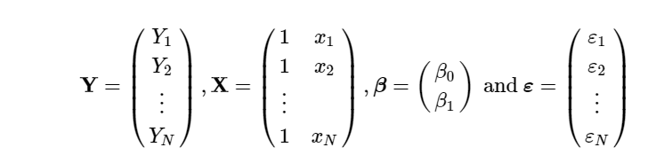
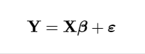

# Introducing the problem

-  Consider two case studies where we look for differentially expressed genes

  1.  A mouse model where we have knocked out a gene which regulates cholesterol levels. We wish to see which other genes are altered by comparing gene expression between normal and KO mice.mutant and wild type mice

  2.  A study where we wish to compare how three distinct brain regions are differently affected by moderate or severe ischemic accidents on patients with or without previous treatment on blood liquidity.

---

# From experimental design to linear models

- Case (1) and (2) have clearly different Experimental Designs but

  - both can be represented using an appropriate linear model
  - this representation will guide the analysis to select differentially expressed gens.

- Linear models provide a convenient setting to describe experimental designs and to analyze data that has been obtained from experiments performed according to the design they describe (more about this later)

---

# The general linear model


- Linear models assume a linear relation between a _response_ "dependent") variable, and one or more _explanatory_ (or "independent") variables(s).

- Many common problems can be re-written as linear models.

  [Common statistical tests are linear models](https://lindeloev.github.io/tests-as-linear/)

---

# Comparison of 2 groups = t-test
<p>
.center[ 
 
<p>
 
 ]

---

# Comparison of three groups (ANOVA)

<p>
.center[ 
 
<p>
 
 ]

---

# Estimating a linear model

- For linear models to be useful, we have to _estimate_ the unknown values $\beta_i$.

- The standard approach in science is to find the values that minimize the distance of the fitted model to the data. 

- The following is called the least squares (LS) equation:

<!-- $$ -->
<!-- RSS = \sum_{i=1}^n \left\{  y_i - \left(\beta_0 + \beta_1 x_i \right)\right\}^2 -->
<!-- $$ -->
.center[ 

]
- This quantity is called the residual sum of squares (RSS). 

- Once we find the values that minimize the RSS, we will call the values the _least squares estimates (LSE)_ and denote them with  $\hat \beta_i$.


---

# Matrix notation for linear models

- Linear models can be written as:
  - explicit expressions (above) or 
  - using matrix notation (below)

.center[ 

]

- Matrix notation is generally preferred.
  - More compact notation
  - More efficient computations.
  
---

# Computers prefer matrices

- Many languages are ready to perform matrix operations in parallel which yields a smaller number of operations and a smaller computing time 
- Higher efficency is also due to the implicit use of matrix algebra libraries.

<p>


---

# Two groups in matrix notation

<p>
.center[

]

---

# Three groups in matrix notation

.center[

]

---

# Fitting linear models

- A linear model can be _fitted_ by solving the _normal equations_


- Error estimates for the model coefficients can also be obtained:


---

# Significance testing with linear models.

- Assuming a series of assumptions hold

  - Variance homogeneity
  - Linearity of relations
  - Independence and _normality_ of error terms
  
- A test can be built to test the significance of the model coefficients


<!-- --- -->

<!-- # The power of linear models: crossed designs -->

<!--  -->

<!-- We assume effects are additive! -->

<!-- --- -->

<!-- # Crossed designs with interaction -->

<!--  -->

<!-- Interaction shows additional to additive effects -->

---

# How linear models are often used

A common quote in science papers:

*"The study of ... controlled for age, race, and sex ..."*

When what they really mean is:


But **do we really believe that age effect is linear?**

---

# Linear models and the Design Matrix

## Example (_back to the two groups comparison_)

- Consider a study comparing __two diets__ in mice, a "standard" vs a "high-fat" one.

- If we consider that the weight of the animals is a linear function of the diets, the following linear model can be written:

$$ 
Y_i = \beta_0 + \beta_1 x_i + \varepsilon_i, i=1,\dots,N 
$$
- where:
  - $Y_i$ represents the weights of the i-th experimental unit-
      - The term *experimental unit* describes the $N$ different entities from which we obtain a measurement. In this case this is "mice".
  - $x_i$ is equal to 1 only when mouse $i$ receives the high fat diet and 0 when it receives the standard diet.
      - We call thees variables *indicator variables* since they simply indicate if the experimental unit had a certain characteristic or not.

---

# A matrix representation

- We can use matrix notation to represent this model:

.center[ 

]

<!-- $$ -->
<!-- \mathbf{Y} = \begin{pmatrix} -->
<!-- Y_1\\ -->
<!-- Y_2\\ -->
<!-- \vdots\\ -->
<!-- Y_N -->
<!-- \end{pmatrix} -->
<!-- , -->
<!-- \mathbf{X} = \begin{pmatrix} -->
<!-- 1&x_1\\ -->
<!-- 1&x_2\\ -->
<!-- \vdots\\ -->
<!-- 1&x_N -->
<!-- \end{pmatrix} -->
<!-- , -->
<!-- \boldsymbol{\beta} = \begin{pmatrix} -->
<!-- \beta_0\\ -->
<!-- \beta_1 -->
<!-- \end{pmatrix} \mbox{ and } -->
<!-- \boldsymbol{\varepsilon} = \begin{pmatrix} -->
<!-- \varepsilon_1\\ -->
<!-- \varepsilon_2\\ -->
<!-- \vdots\\ -->
<!-- \varepsilon_N -->
<!-- \end{pmatrix} -->
<!-- $$ -->

<!-- as: -->

<!-- $$ -->
<!-- \, -->
<!-- \begin{pmatrix} -->
<!-- Y_1\\ -->
<!-- Y_2\\ -->
<!-- \vdots\\ -->
<!-- Y_N -->
<!-- \end{pmatrix} =  -->
<!-- \begin{pmatrix} -->
<!-- 1&x_1\\ -->
<!-- 1&x_2\\ -->
<!-- \vdots\\ -->
<!-- 1&x_N -->
<!-- \end{pmatrix} -->
<!-- \begin{pmatrix} -->
<!-- \beta_0\\ -->
<!-- \beta_1 -->
<!-- \end{pmatrix} + -->
<!-- \begin{pmatrix} -->
<!-- \varepsilon_1\\ -->
<!-- \varepsilon_2\\ -->
<!-- \vdots\\ -->
<!-- \varepsilon_N -->
<!-- \end{pmatrix} -->
<!-- $$ -->

or simply:

<!-- $$ -->
<!-- \mathbf{Y}=\mathbf{X}\boldsymbol{\beta}+\boldsymbol{\varepsilon} -->
<!-- $$ -->

.center[ 

]

The design matrix is the matrix $\mathbf{X}$.

---

# Fitting the model

- Once we define a design matrix, we are ready to find the least squares estimates. We refer to this as *fitting the model*.

- We have seen that this can be expressed in matrix notation as:


---

# Fitting linear models in R

- In practice however **we rarely compute directly the expression above**.

- Instead, for fitting linear models in R, we will provide a *formula* to the `lm` function.

- This is illustrated in the following slides using the `model.matrix` function, which is used internally by the `lm` function.

- This will help us to connect the R `formula` with the matrix $\mathbf{X}$. It will therefore help us interpret the results from `lm`.

---

# Expressing experimental designs using R formula

- Two R functions can be used to build design matrices for a variety of mdels:

  - `formula` to describe the model through the relation between the variables
  - `model.matrix` to build the design matrix from the given formula

- The choice of design matrix is a critical step in linear modeling as it encodes which coefficients will be fit in the model, and the inter-relationship between the samples.
  - The same data can be modelled differently, if the parameters are assigned different meanings.
  - In practice this represents using distinct design matrices.

---

# Model matrix for two groups

- Suppose we have two groups, 1 and 2, with two samples each.
- We might start to encode this experimental design like so:

```{r}
x <- c(1,1,2,2)
f <- formula(~ x)
model.matrix(f)
```

---

# Model matrix for two groups (2)

- Note that an intercept will be included by default, so the formula could equivalently be written: `~ x + 1`.

- We can then inspect the design matrix which is formed by this:

```{r}
model.matrix(f)
```

---

# model.matrix requires factors

- Note, this is not the design matrix we wanted.
- We should instead first tell R that these values should not be interpreted numerically, but as different levels of a factor variable:

```{r}
x <- factor(c(1,1,2,2))
model.matrix(~ x)
```

- Now we have achieved the correct design matrix.
- Or have we?

---

# The role of the intercept term

- Note that the previous matrix has one intercept column and one group column although there are two groups indeed.

  - The first group's values are represented by the basal or "overall mean".
  - The second group's are represented by one column.

- An alternative representation is possible setting the intercept to zero.

```{r}
x <- factor(c(1,1,2,2))
model.matrix(~ x + 0)
```

- Both representations are equivalent and for one-factor designs it's up to you which one to choose

---

# Design matrix for more than 2 groups

- How is the design matrix for an experiment with 3 groups?
- We proceed like in the previous case

```{r}
x <- factor(c(1,1,2,2,3,3))
model.matrix(~ x)
```

- Again the first group is implicit in the intercept but it can be set explicitly by setting the intercept to zero.

---

# An alternative parametrization

-   An alternate formulation of design matrix is possible by specifying `+0` in the formula:

```{r}
x <- factor(c(1,1,2,2,3,3))
model.matrix(~ x + 0)
```

- This representation allows fitting a separate coefficient for each group.

---

# Design matrices for more complex designs

- Matrices for more complex designs can be built easily by

  - First creating the corresponding factors with their levels and then
  - Applying model.matrix on a formula that describes the design

- For example for a $2\times2$ design without interaction::

```{r}
x <- factor(c(1,1,1,1,2,2,2,2))
y <- factor(c("a","a","b","b","a","a","b","b"))
mm<- model.matrix(~ x + y)
```

- We could say that this linear model accounts for differences in both the x and y variables.
- We assume in the above model specification, that the effect of the x and y variables are simply additive. Being in group 2 and group b is equal to the difference between 2 and 1 and the difference between b and a.

---

```{r}
x <- factor(c(1,1,1,1,2,2,2,2))
y <- factor(c("a","a","b","b","a","a","b","b"))
model.matrix(~ 0+ x + y)
```

- Notice that adding a 0 term only provides two columns for the first factor

---

# Design matrix for designs with interaction term

- Another model is possible which fits and additional term, which encodes the potential interaction of x and y variables.
- This can be written in either of the following two formula:

```{r}
model.matrix(~ x + y + x:y)
model.matrix(~ x*y)
```

---

# Linear models for microarray data

- For the analysis of omics data a very popular option is the `limma` package.

- `limma` extends some R functionalities to make them easy to use in the analysis of omics data using linear models.

- Besides this it includes extensions to the standard linear model to improve analysis capabilities.

- In the following we show

  - How to create a design matrix from a "targets" file containing information on groups.
  - How to create a contrasts matrix to define the comparisons to be done.
    -   How to do the comparisons and how to interpret the resulting analysis tables.
