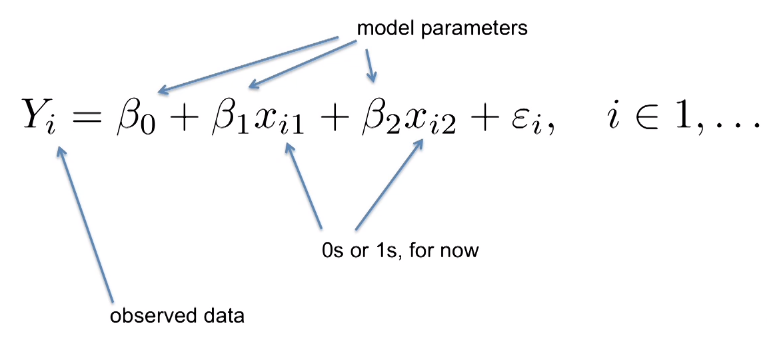
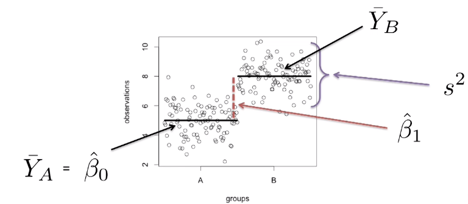
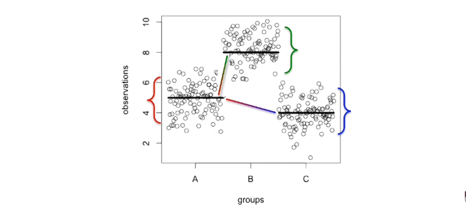
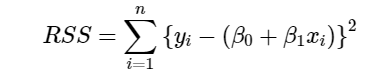
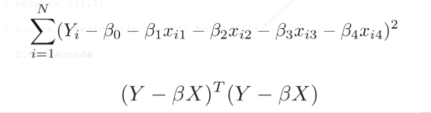
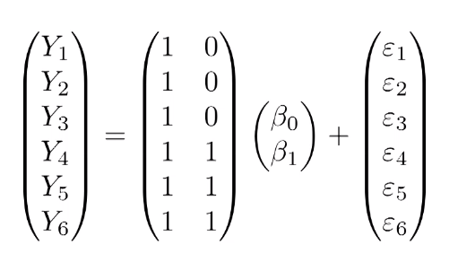
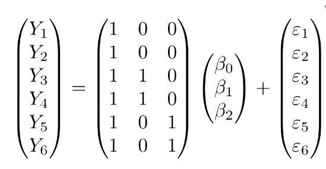
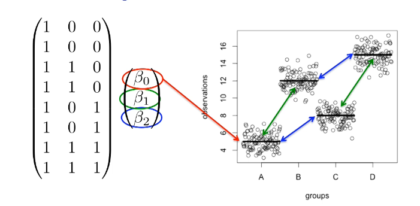
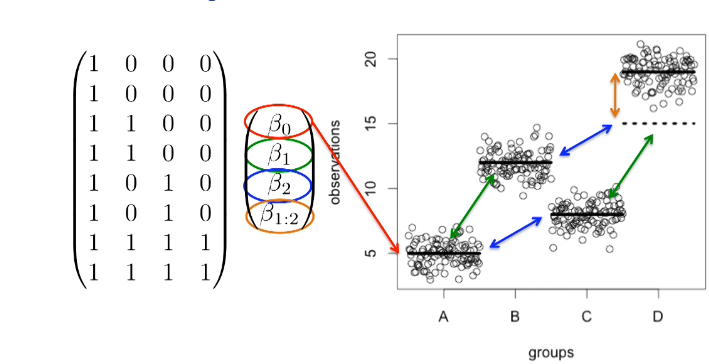
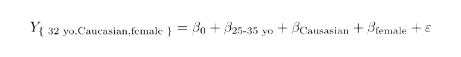

```{r toDoTOC, echo=FALSE, eval=FALSE}

require("magrittr")

file_name <- rstudioapi::getSourceEditorContext()[["path"]]

doc <- toc <- readLines(file_name)
tocc <- character()
for (i in 1:length(toc)) {
  if(substr(toc[i][1], 1, 2) == "# ") {
    toc[i] <- gsub("# ", "", toc[i], fixed = TRUE) %>% 
                gsub("#", "", ., fixed = TRUE)
    tocc <- append(tocc, toc[i])
  }
}

tocc <- paste("- ", tocc[-1])

row_outline <- which(doc == "# Outline")
row_body <- which(doc == "---")
row_body <- row_body[which(row_body > row_outline)][1]

doc <- c(doc[1:row_outline], "\n", tocc, "\n", doc[(row_body):length(doc)])


writeLines(doc, file_name)

```


# Outline

.columnwide[
  ### 1) [A recap on linear models](#review)
  ### 2) [Linear models with R](#lm)
  ### 3) [Linear models for omics data](#limma)
  ### 4) [Exercises](#exercises)
]

---

class: inverse, middle, center

name: review

# A recap on linear models <a id="review"></a>

---

# What is a linear model (in statistics)

- Linear models appear when we assume that the relation between:

  - one variable, 
  - and another (set of) variable(s)
  
  can be represented through a linear relation, that is, one of the form
  $$
  y \simeq a + b\times x \quad \mbox{ or:} \quad y \simeq a + b\times x + c \times z + \dots
  $$
- Linear models have been thoroughly used because of their flexibility and many of the important techniques in statistics are "just" linear models.

---

# Regression,  ANOVA are linear models

- Linear models provide a flexible way to modelling relations and building explanatory or predictive models, as seen in **linear regression**.

$$
Y\_i = \beta\_0 + \beta\_1 \times X\_{1i} + \beta\_2 \times X\_{2i}  + \dots+ \epsilon\_i
$$

- But they also provide a convenient setting to 
      - describe experimental designs and 
      - to analyze data that has been obtained from experiments performed according to the design they describe, as seen in **ANOVA**.
    
$$
Y\_{ij}=\mu\_i+e\_{ij}=\mu+\tau\_i+e\_{ij}, \quad i=1\dots k,\quad j=1\dots r.
$$

---

# Linear models. An example

- Consider a study comparing __two diets__ in mice, a "standard" vs a "high-fat" one.

- If _we consider that the weight of the animals is a linear function of the diets_, the following linear model can be written:

$$ 
Y_i = \beta_0 + \beta_1 x_i + \varepsilon_i, i=1,\dots,N 
$$
- where:
  - $Y_i$ represents the weights of the i-th experimental unit-
      <!-- - The term *experimental unit* describes the $N$ different entities from which we obtain a measurement. In this case this is "mice". -->
  - $x_i = 1$ when mouse $i$ receives the high fat diet and <br>  $x_i = 0$  when it receives the standard diet.
      <!-- - We call thees variables *indicator variables* since they simply indicate if the experimental unit had a certain characteristic or not. -->
      
- The main goal of the study are:

  - To *estimate* the mean weight of mice after having been nurrished with each diet
  - To *compare* the difference in weight between the standard and "high fat" diets.

---

# The general linear model



- Linear models assume a linear relation between a _response_ "dependent") variable, and one or more _explanatory_ (or "independent") variables(s).

- Many common problems can be re-written as linear models.

  [Common statistical tests are linear models](https://lindeloev.github.io/tests-as-linear/)

---

# Comparison of 2 groups (t-test)

- The coefficients represent the (differential) effect of diet
- Comparison between diets can be based on the means or on the coefficients.

.center[ 
 
<p>
 
 ]


---

# Comparison of three groups (ANOVA)

.pull-left[
.center[ 
 
<p>
 
 ]
]
.pull-right[
- With more than two diets the scenario is similar
  - $\beta_0$ represents the "control" or standard
  - $\beta_1$ , $\beta_2$ the effect of each diet added to the standard
- Comparisons can be based on
  - The means
  - The coefficients
]

- Notice that, although the linear model postulates a relation between _parameters_ we will work with their _estimates_ so, there is an error that we need to control in order for our conclusions (inferences) to be reliable.
---

# Estimating a linear model

- For linear models to be useful, we have to _estimate_ the unknown values $\beta_i$.

- The standard approach in science is to find the values that minimize the distance of the fitted model to the data. 

- The following is called the least squares (LS) equation:

<!-- $$ -->
<!-- RSS = \sum_{i=1}^n \left\{  y_i - \left(\beta_0 + \beta_1 x_i \right)\right\}^2 -->
<!-- $$ -->

.center[ 

]
- This quantity is called the residual sum of squares (RSS). 

- Once we find the values that minimize the RSS, we will call the values the _least squares estimates (LSE)_ and denote them with  $\hat \beta_i$.


---

# Matrix notation for linear models

- Linear models can be written as:
  - explicit expressions (above) or 
  - using matrix notation (below)

.center[ 

]

- Matrix notation is generally preferred.
  - More compact notation
  - More efficient computations.
  
---

<!-- # Computers prefer matrices -->

<!-- - Many languages are ready to perform matrix operations in parallel which yields a smaller number of operations and a smaller computing time  -->
<!-- - Higher efficency is also due to the implicit use of matrix algebra libraries. -->

<!-- <p> -->

<!--  -->

<!-- --- -->

# Two groups in matrix notation

<p>
.center[

]

This _linear model_ can be written in more compact notations as:

$$
\mathbf{Y}=\mathbf{X}\boldsymbol{\beta}+\boldsymbol{\varepsilon}
$$
The matrix $\mathbf{X}$ is called the _design matrix_
---

# Three groups in matrix notation

.center[

]

---

# Fitting linear models

- A linear model can be _fitted_ by solving the _normal equations_


- Error estimates for the model coefficients can also be obtained:


---

# Significance testing with linear models.

- Assuming a series of assumptions hold

  - Variance homogeneity
  - Linearity of relations
  - Independence and _normality_ of error terms
  
- A test can be built to test the significance of the model coefficients


---

# More linear models: crossed designs 

 

- We assume effects are additive!

---
# Crossed designs with interaction 



- Interaction shows additional to additive effects 

---

# How is a linear models usually applied?

- Estimating the parameters values to know mean effect of one factor or of each level od this factor.
  
- Comparing the parameters' values  to decide if different treatments have the same effect, or have any effect at all.
  
- Adjusting the effect of distinct covariables, which may not be of direct interest ion the studyu but whose effect may interfere in the relation between the response variable and the explanatory ones.
  
  - A common quote in papers: *"The study of ... controlled for age, race, and sex ..."*,
  - Usually, what it means is that we have included thes variables in the model expecting the variability that they explain is separated from that explained buy the other components of the model.
        


---

class: inverse, middle, center

name: review

# Linear models in R <a id="lm"></a>


---

# Fitting linear models in R

- In practice, when using R, _we rarely fit a model by solving the normal equations_

- The usual, and most practical way to do it, is to use `lm` function.

- The `lm` function requires

  - Either a `formula` relating the variables to be included in a linear model
  
  - Or a design matrix, that we can create using the `model.matrix` function, and which, implicitly, defines that model.

---

# The importance of the design matrix

- The choice of design matrix is a _critical step_ in linear modeling as

  - it encodes which coefficients will be fit in the model, 
  - and the inter-relationship between the samples.

--

- Defining which design matrix we use is equivalent to defining the parameters of the model (or the model's _parametrization_).

  - Same data can be modelled differently, if parameters receive different meanings.

  - In practice this represents using distinct design matrices
  
- A typical example: How does the meaning of a one-way factor ANOVA change if we consider a model with or without an intercept?
  - How is it reflected in the design matrix?

---

# Model matrix for two groups

- Suppose we have two groups, 1 and 2, with two samples each.
- We might start to encode this experimental design like so:

```{r}
x <- c(1,1,2,2)
f <- formula(~ x)
model.matrix(f)
```

---

# Model matrix for two groups (2)

- Note that an intercept will be included by default, so the formula could equivalently be written: `~ x + 1`.

- We can then inspect the design matrix which is formed by this:

```{r}
model.matrix(f)
```

---

# model.matrix requires factors

.pull-left[
- Note, this is not the design matrix we wanted.
- We should instead first tell R that these values should not be interpreted numerically, but as different levels of a factor variable:

]

.pull-right[

```{r}
x <- factor(c(1,1,2,2))
model.matrix(~ x)
```
]

- Now we have achieved the correct design matrix.
- Or have we?
---

# The role of the intercept term

.pull-left[
- Note that the previous matrix has one intercept column and one group column although there are two groups indeed.

  - The first group's values are represented by the basal or "overall mean".
  - The second group's are represented by one column.

- An alternative representation is possible setting the intercept to zero.

- Both representations are equivalent and for one-factor designs it's up to you which one to choose
]

.pull-right[
```{r}
x <- factor(c(1,1,2,2))
model.matrix(~ x + 0)
```
]


---

# Design matrix for more than 2 groups

- How is the design matrix for an experiment with 3 groups?
- We proceed like in the previous case

```{r}
x <- factor(c(1,1,2,2,3,3))
model.matrix(~ x)
```

- Again the first group is implicit in the intercept but it can be set explicitly by setting the intercept to zero.

---

# An alternative parametrization

-   An alternate formulation of design matrix is possible by specifying `+0` in the formula:

```{r}
x <- factor(c(1,1,2,2,3,3))
model.matrix(~ x + 0)
```

- This representation allows fitting a separate coefficient for each group.

---


class: inverse, middle, center

name: limma

# Linear Models for Omics Data <a id="limma"></a>

---

# Linear models for omics data

- For the analysis of omics data a very popular option is the `limma` package.

- `limma` extends some R functionalities to make them easy to use in the analysis of omics data using linear models.

- Besides this it includes extensions to the standard linear model to improve analysis capabilities.

- In the following we show

  - How to create a design matrix from a "targets" file containing information on groups.
  - How to create a contrasts matrix to define the comparisons to be done.
    -   How to do the comparisons and how to interpret the resulting analysis tables.

---

# Example: Comparing 3 types of tumors

- This example study is based on a paper published in  http://www.ncbi.nlm.nih.gov/pubmed/15897907 whose data are available in GEO as series GSE1561 series on the following link
http://www.ncbi.nlm.nih.gov/geo/query/acc.cgi?acc=GSE1561

- The researchers investigated three types of breast cancer tumors: apocrine (APO), basal (BAS) and luminal (LUMI). 

- The classification is based on the resistance of tumors to estrogen and androgen receptors.

  - Tumors classified as "APO" are negative for estrogen receptor (ER-) and positive for the androgen receptor (AR+).
  - Those classified as "LUMI" are ER + and AR + and
  - Those classified as "BAS" are ER- and AR.

---

# Identifying groups and comparisons

- The assignment of each sample to an experimental group can be obtained from this link:
http://www.ncbi.nlm.nih.gov/geo/gds/profileGraph.cgi?gds=1329

- Obviously this is an observational study but its analysis can be done using a linear model approach as well.

- We will usually proceed in three steps:

1. Identify the experimental factors and their levels.
2. Write the design matrix associated with this study design.
3. Build the contrast matrix that defines the comparisons we are interested in.

- In this example we have identified three groups and we wish to compare each tumor type with the oher two

    1. "APO" vs “LUMI”
    2. “APO" vs “BAS”
    3. “LUMI" vas "BAS"

---

# Defining the groups

- An easy way to define the study groups consists of preparing a text file where these are established.

```{r readTargets}
url <- "https://raw.githubusercontent.com/ASPteaching"
repo <- "Introduction_to_Design_of_Experiments"
folder <- "main/omicsData/dataset_2_Breast_cancer_GSE1561/data"
dataFile <- "BreastCancerGSE1561.csv"
targetsFile <- "targets.txt"
targetsFileName <- paste(url, repo, folder, targetsFile, sep="/")
```

---
# The `targets`file

```{r readTargets2}
library(magrittr)
targets <-read.table(targetsFileName, row.names=1, head=T)
```

<small>
```{r readTargets3}
kableExtra::kable(head(targets[,1:6]), n=7) %>% kableExtra::kable_styling()
```
_Showing only first 7 rows_
</small>
---

# Creating the design matrix

.pull-left[
```{r designMatrix1a}
design<-matrix(
  c(1,1,1,1,1,0,0,0,0,0,0,0,0,0,0,
    0,0,0,0,0,1,1,1,1,1,0,0,0,0,0,
    0,0,0,0,0,0,0,0,0,0,1,1,1,1,1),
  nrow=15,byrow=F)
colnames(design) <-c("A", "B", "L")
rownames(design)<-  targets$Sample
```
]

.pull-right[
```{r designMatrix1b}
print(design)
```
]
---

# Another way to create the design matrix 

.pull-left[
<small>
```{r designMatrix2a}
design2 <-model.matrix(~ 0+targets$Group)
colnames(design2)<-c("A", "B", "L")
rownames(design2)<-  targets$Sample
```
</small>
]

.pull-right[
```{r designMatrix2b}
print(design2)
```
]
---

# Defining the questions: The contrast matrix

```{r contrastsMatrix}
library(limma)
cont.matrix <- makeContrasts (
  AvsB = B-A,
  AvsL = L-A,
  BvsL = L-B,
  levels=design)
cont.matrix
```

---

# Data for the analysis

- Data can be obtained from the open repository Gene Expression Omnibus but, for simplicity, it has been downloaded and prepared for the analysis.

- They are also available remotely at the sub-directory "omicsData"

```{r readData}
dataFile <- "BreastCancerGSE1561.csv"
dataFileName <- paste(url, repo, folder, dataFile, sep="/")

dataMatrix <- read.csv(dataFileName, row.names=1)

colnames(dataMatrix)==rownames(targets)
dim(dataMatrix)
```

---

# Fit the model and the contrasts

- Once we have the data, the design matrix and the contrast matrix we can proceed to estimate the model,  fit the contrasts and check the results

```{r fitModel}
fit<-lmFit(dataMatrix, design)
fit.main<-contrasts.fit(fit, cont.matrix)
fit.main<-eBayes(fit.main)
```

- This creates an object, which is called here `fit.main` from where distinct results can be extracted.

---

# Results are in "topTables"

- For each comparison in the contrast matrix a "top Table" can be generated showing features sorted from most to least differentially expressed, based on the test p-value.

```{r extractResults}
topTab_AvsB <- topTable (fit.main, number=nrow(fit.main), coef="AvsB", adjust="fdr")
kableExtra::kable(head(topTab_AvsB, n=5)) %>% kableExtra::kable_styling()
# topTab_AvsL <- topTable (fit.main, number=nrow(fit.main), coef="AvsL", adjust="fdr"); head(topTab_AvsL)
# topTab_BvsL  <- topTable (fit.main, number=nrow(fit.main) , coef="BvsL", adjust="fdr"); head(topTab_BvsL)
```

---

# Volcano plots provide visualization

.pull-left[
- A volcano plot shows, for each comparison
  - the magnitude of the change ("biological significance") vs
  - the "statistical significance" (-log p-value)
]

.pull-right[
.center[
```{r showResults, out.width="100%"}
volcanoplot(fit.main, coef="AvsB", 
            highlight=10)
```
]
]
---

class: inverse, middle, center

name: exercises

# Exercises <a id="exercises"></a>

---

# Exercises on linear models for omics

- You can go through the exercises in the document "Exercises on linear models for microarrays"

  - Start by reading the experiment description
  - Postulate the type of experimental design
  - Write the linear model
  - Create the design and the contrast matrix
  - Get the data
  - Fit the model 
  - Examine the results
